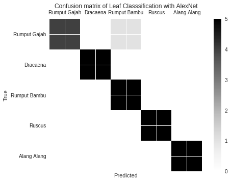
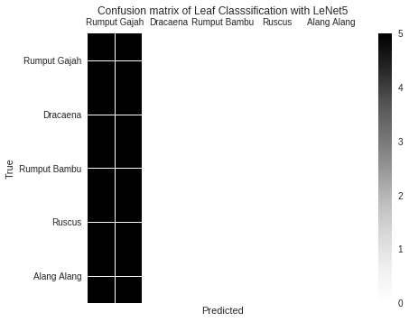
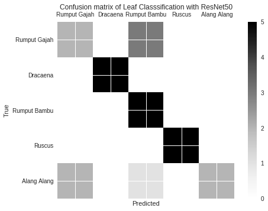
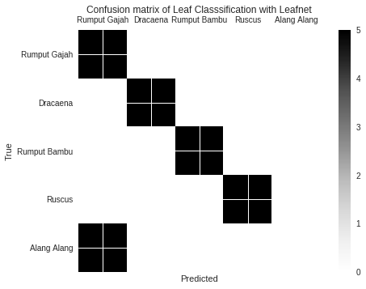
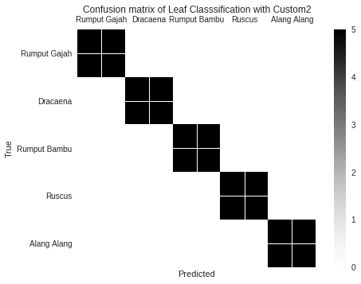

# Leaf Classification

This project aims to classify leaf types using deep learning with various CNN architectures. There are two types of preprocessing: standard and multicolor (specifically for Dracaena/lucky bamboo leaves).

---

## Preprocessing

### 1. Standard Preprocessing
Used for most leaves:
- **Cropping & Rotate:** Crop and rotate images to center the leaf object.
- **Brightening:** Increase image brightness.
- **Median Blur (Denoising):** Reduce noise in the image.
- **Thresholding Binary (Binarize):** Convert the image to binary (black and white).
- **Get Biggest Scratch:** Extract the largest leaf area.
- **Replace White:** Replace the white background.

### 2. Multicolor Preprocessing (For Dracaena Only)
Used for Dracaena/lucky bamboo leaves:
- **Cropping & Rotate**
- **Brightening**
- **Binarize Multicolor**
- **Denoising Colored**
- **Gaussian Blur**
- **Conversion to HSV**
- **Thresholding Yellow Color**
- **Morphology Closing**
- **Get Biggest Scratch**
- **Replace White**

> **Note:**  
> Multicolor preprocessing is only used for Dracaena/lucky bamboo leaves.

---

## Workflow

1. **Split Data**
   - Split the data into train, test, and validation sets.
   - Perform data split for train & test.

2. **Preprocessing**
   - Apply standard preprocessing for regular leaves.
   - Apply multicolor preprocessing for Dracaena leaves.

3. **Training**
   - Train the model with various CNN architectures (AlexNet, LeNet5, ResNet50, LeafNet, Custom1, Custom2).

4. **Validation**
   - Validate the model using the validation data.

5. **Predict**
   - Predict the leaf type on new data using the trained model.

---

## Requirements

- Python 2.x & Python 3.x
- Keras & TensorFlow
- OpenCV
- NumPy
- scikit-learn
- Google Colab (recommended)

---

## Model Accuracy & Loss Results

| Architecture     | Top 1 Acc | Top 1 Loss | Top 1 Val Acc | Top 1 Val Loss | Top 5 Acc | Top 5 Loss | Top 5 Val Acc | Top 5 Val Loss |
|-----------|-----------|------------|---------------|---------------|-----------|------------|---------------|---------------|
| LeNet5    | 0.9853    | 0.0446     | 0.2423        | 10.4603       | 0.9915    | 0.0248     | 0.2924        | 10.2835       |
| AlexNet   | 0.9722    | 0.0818     | 0.9499        | 0.1995        | 0.9775    | 0.0587     | 0.9788        | 0.1767        |
| LeafNet   | 0.9698    | 0.0928     | 0.7428        | 1.1867        | 0.9728    | 0.0998     | 0.9237        | 0.2735        |
| ResNet50  | 0.9848    | 0.0427     | 0.7839        | 0.9675        | 0.9890    | 0.0408     | 0.9499        | 0.1173        |
| Custom1   | 0.9706    | 0.0733     | 0.9453        | 0.2361        | 0.9754    | 0.0737     | 0.9537        | 0.1060        |
| Custom2   | 0.9738    | 0.0689     | 0.9060        | 0.2579        | 0.9765    | 0.0638     | 0.9198        | 0.2935        |

**Description:**
- **Acc:** Accuracy on training data
- **Loss:** Loss on training data
- **Val Acc:** Accuracy on validation data
- **Val Loss:** Loss on validation data

---

The table above shows the performance of each model architecture for leaf classification, both for Top 1 and Top 5 best predictions.

---

## Confusion Matrix

Below are confusion matrices and accuracy values from several CNN architectures used:

| AlexNet | LeNet5 | ResNet50 |
|---------|--------|----------|
|  |  |  |

| LeafNet | Custom1 | Custom2 |
|---------|---------|---------|
|  |  |  |

Each image shows the confusion matrix and the final accuracy value of the corresponding model.

## API Implementation

The API implementation for this project is available at [https://github.com/hafiizhekom/daunesia-api](https://github.com/hafiizhekom/daunesia-api).

---
